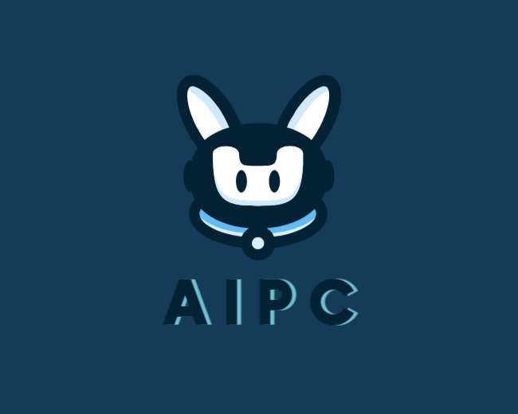

<div align="center">



[ English | [中文](README_ZH.md) ]

AIPC (Chat2BI) is an assistant that utilizes large language models to perform a wide range of tool invocations. AIPC provides tool categorization, enabling or disabling tools. It can help you retrieve enterprise-level APIs, PC intelligent control, and more.
</div>


## Update History
- 2024.03.29 Added support for vllm to perform model inference.
- 2024.03.27 Added PC control interface, now you can use natural language to control your PC through the model.
- 2024.03.25 Implemented tool building with langchain, eliminating the need for manual construction of tool description information.
- 2023.12.18 Supported downloading and retrieving models from the Moda community.
- 2023.12.15 Supported API services. tag:[#3](https://github.com/mMrBun/Chat2BI/issues/3)
- 2023.12.14 Changed `model.generate()` to `model.chat()`. tag:[#6](https://github.com/mMrBun/Chat2BI/issues/6)
- 2023.12.14 Optimized ECHARTS_PROMPT to improve the success rate of generating charts. tag:[#5](https://github.com/mMrBun/Chat2BI/issues/5)


## Roadmap

- [x] Support for API services [#3](https://github.com/mMrBun/Chat2BI/issues/3)
- [x] Support for PC control interface 
- [x] Support for inference using vllm
- [x] Support for tool building with langchain
- [ ] Support for connecting to a database to perform data queries as a data source for chart generation
- [ ] Provide fine-tuning examples for tool invocation commands
- [ ] Provide training examples for retrieval models

## Quick Start
Modify `RETRIEVAL_MODEL_PATH` in configs/base_config.py to your retrieval model path.

The training of this search engine agent's model is based on the code from the ToolBench repository. If you're interested in the dataset and training code, you can refer to the source repository.
[ToolBench/Training Retriever](https://github.com/OpenBMB/ToolBench?tab=readme-ov-file#training-retriever)

If you don't have a retrieval model, you can download the model from the following links.

|      Model       |                                                              Download                                                              |
|:----------------:|:----------------------------------------------------------------------------------------------------------------------------------:|
|   MrBun/ToolRetrieval_IR_bert_based_chinese    |                          [🤗HuggingFace](https://huggingface.co/MrBun/ToolRetrieval_IR_bert_based_chinese)  / [ModelScope](https://modelscope.cn/models/mrsteamedbun/ToolRetrieval_IR_bert_based_chinese/summary)  |


## Setting Up a Virtual Environment
```bash
git clone https://github.com/mMrBun/AIPC.git
conda create -n AIPC python=3.10

conda activate AIPC

cd AIPC

pip install -r requirements.txt
```
> [!NOTE]
> 
> Some dependencies in the requirement file cannot be installed on certain operating systems. To avoid installation errors, you can comment out these dependencies.

## How to Add a New Tool?
If you have used langchain, you should be familiar with customizing tools. You can add a new custom tool under the `tools` directory, and refer to the existing tools for the specific format.
Of course, to avoid the difficulty of maintaining too many tools, you can create folders to categorize the tools, and the `enabled` field in the tools can control whether the tool is enabled or not. No additional configuration is needed; the tools you create will automatically be registered with the existing tools when the program starts.

## How to Invoke Tools with LLM?
The principle of tool invocation can refer to [OpenAI Function Calling](https://platform.openai.com/docs/guides/function-calling). If the model you are using does not have the capability of calling tools, you can fine-tune the tool invocation commands with [LLaMA-Factory](https://github.com/hiyouga/LLaMA-Factory).

## Why Train an Embedding Model as a Tool Retriever?
Certainly, if your API doesn't involve proprietary terms or specific semantic content, you can use an open-source embedding model for semantic query retrieval of tools. Training an embedding model is to make it perform better in downstream tasks.

## API Service

```bash
python api_demo.py \
    --model_name_or_path /path/to/your/model \
    --template default \
    --infer_backend vllm
```
> [!NOTE]
> 
> VLLM is currently not available on Windows; the infer_backend can be omitted or changed to huggingface
> 
> The template can refer to the configuration in the [model list](https://github.com/hiyouga/LLaMA-Factory?tab=readme-ov-file#supported-models)


## Acknowledgments
The code in this repository is inspired by the following open-source projects. Thanks to the work of these open-source projects.

[LLaMA-Factory](https://github.com/hiyouga/LLaMA-Factory)

[Qwen](https://github.com/QwenLM/Qwen)

[ChatGLM3](https://github.com/THUDM/ChatGLM3)

[VLLM](https://github.com/vllm-project/vllm)

