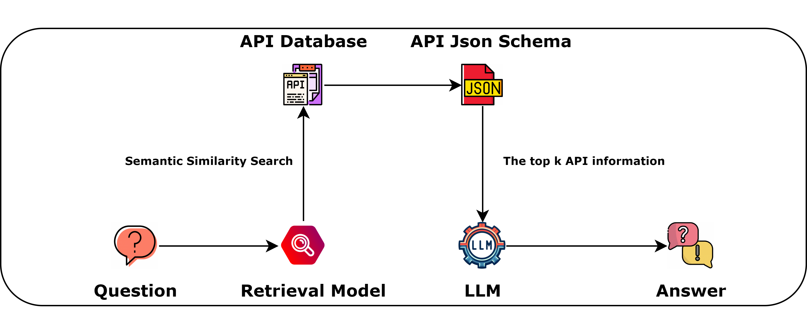

<div align="center">
<h1>Chat2BI</h1>
Chat2BI is an assistant that utilizes large language models to perform extensive tool calls. It can help you retrieve enterprise-level APIs, providing a one-stop service for API invocation, data visualization, and more.

Flow Chart

[//]: # (![# Chat2BI]&#40;assets/flow_chart.png &#41;)



</div>


## Changelog

- 2023.12.18 Support download retrieval model from modelscope.
- 2023.12.15 Support api server. tag:[#3](https://github.com/mMrBun/Chat2BI/issues/3)
- 2023.12.14 Change `model.generate()` to `model.chat()`. tag:[#6](https://github.com/mMrBun/Chat2BI/issues/6)
- 2023.12.14 Optimize ECHARTS_PROMPT to improve the success rate of chart rendering. tag:[#5](https://github.com/mMrBun/Chat2BI/issues/5)


## Roadmap
- [x] Support api server [#3](https://github.com/mMrBun/Chat2BI/issues/3)


## Quick Start

Place the retrieval model in the retriever/retriever_model directory.
The retrieval model used to train this search engine agent is based on the code from the ToolBench repository. If you are interested in the dataset and training code, you can refer to the source repository.
[ToolBench/Training Retriever](https://github.com/OpenBMB/ToolBench?tab=readme-ov-file#training-retriever)

|      Model       |                                                              Download                                                              |
|:----------------:|:----------------------------------------------------------------------------------------------------------------------------------:|
|   MrBun/ToolRetrieval_IR_bert_based_chinese    |                          [🤗HuggingFace](https://huggingface.co/MrBun/ToolRetrieval_IR_bert_based_chinese)  / [ModelScope](https://modelscope.cn/models/mrsteamedbun/ToolRetrieval_IR_bert_based_chinese/summary)  |


## Basic Environment
```bash
git clone https://github.com/mMrBun/Chat2BI.git

conda create -n Chat2BI python=3.10

conda activate Chat2BI

cd Chat2BI

pip install -r requirements.txt
```

## Web Server

```bash
python web_demo.py
```
view the web demo at http://127.0.0.1:7860

## Api Server
```bash
python api_demo.py
```
callable api address at http://127.0.0.1:7861
