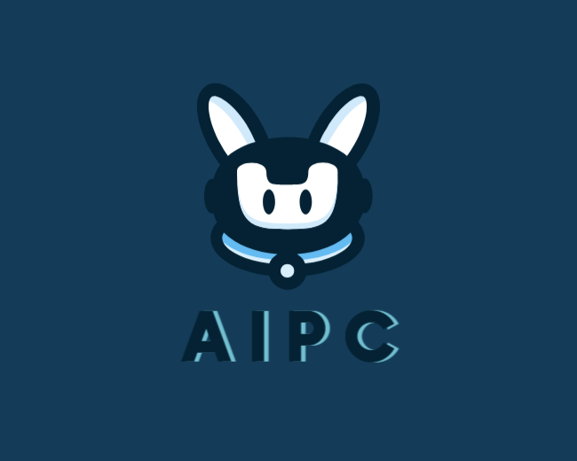

<div align="center">



[ [English](README.md) | 中文 ]


AIPC（Chat2BI）是一个利用大型语言模型执行广泛工具调用的助手。AIPC提供了工具分类，启用或禁用工具。它可以帮助您检索企业级API，PC智能控制等等。
</div>


## 更新历史
- 2024.03.29 支持了vllm进行模型推理。
- 2024.03.27 添加PC控制接口，现在您可以使用自然语言让模型控制PC了。
- 2024.03.25 使用langchain进行工具构建，您无需再手动构建工具描述信息。
- 2023.12.18 支持从魔搭社区下载检索模型.
- 2023.12.15 支持api服务. tag:[#3](https://github.com/mMrBun/Chat2BI/issues/3)
- 2023.12.14 将 `model.generate()` 改为 `model.chat()`. tag:[#6](https://github.com/mMrBun/Chat2BI/issues/6)
- 2023.12.14 优化 ECHARTS_PROMPT 从而改善生成图表的成功率。 tag:[#5](https://github.com/mMrBun/Chat2BI/issues/5)


## 路线
- [x] 支持api服务 [#3](https://github.com/mMrBun/Chat2BI/issues/3)
- [x] 支持PC控制接口 
- [x] 支持使用vllm进行推理
- [x] 支持使用langchain进行工具构建
- [ ] 支持连接数据库进行数据查询作为图表生成的数据源 
- [ ] 提供工具调用指令微调example
- [ ] 提供检索模型训练example


## 快速开始
修改configs/base_config.py中的`RETRIEVAL_MODEL_PATH`为您的检索模型路径。

训练此搜索引擎代理的模型基于ToolBench存储库中的代码。如果您对数据集和训练代码感兴趣，可以参考源存储库。
[ToolBench/Training Retriever](https://github.com/OpenBMB/ToolBench?tab=readme-ov-file#training-retriever)

如果您没有检索模型，您可以从以下链接下载模型。

|      Model       |                                                              Download                                                              |
|:----------------:|:----------------------------------------------------------------------------------------------------------------------------------:|
|   MrBun/ToolRetrieval_IR_bert_based_chinese    |                          [🤗HuggingFace](https://huggingface.co/MrBun/ToolRetrieval_IR_bert_based_chinese)  / [ModelScope](https://modelscope.cn/models/mrsteamedbun/ToolRetrieval_IR_bert_based_chinese/summary)  |


## 创建虚拟环境
```bash
git clone https://github.com/mMrBun/Chat2BI.git

conda create -n Chat2BI python=3.10

conda activate Chat2BI

cd Chat2BI

pip install -r requirements.txt
```
> [!注意]
> 
> 依赖文件中有一部分依赖是某些操作系统无法安装的，为了避免安装报错，您可以将这些依赖注释掉。

## 如何添加一个新工具？
如果您使用过langchain，那么您应该对自定义工具有所了解。您可以在`tools`目录下添加一个新的自定义工具，具体格式可参考现有工具。
当然，为了避免工具过多导致维护困难，您可以创建文件夹对工具进行分类，工具中的`enabled`字段可以控制工具是否启用。您无需任何额外的配置，您创建的工具将在程序启动时自动注册到现有工具中。

## 如何让LLM调用工具？
工具调用原理可参考[OpenAI Function Calling](https://platform.openai.com/docs/guides/function-calling)。如果您使用的模型不具备工具调用的能力，您可以使用[LLaMA-Factory](https://github.com/hiyouga/LLaMA-Factory)进行工具调用指令微调。

## 为什么要训练一个embedding模型作为工具检索器？
当然，如果您的API不涉及到专有名词或特定语义的内容，您可以使用开源embedding模型进行语义查询检索工具。训练一个embedding模型是为了让其在下游任务中表现得更好。

## api服务

```bash
python api_demo.py \
    --model_name_or_path /path/to/your/model \
    --template default \
    --infer_backend vllm
```
> [!注意]
> 
> VLLM目前无法在Windows上使用，infer_backend可以不提供，或改为huggingface
> 
> template可参考[模型列表](https://github.com/hiyouga/LLaMA-Factory?tab=readme-ov-file#supported-models)中的配置


## 致谢
本仓库代码参考来自于以下开源项目，感谢这些开源项目的工作。

[LLaMA-Factory](https://github.com/hiyouga/LLaMA-Factory)

[Qwen](https://github.com/QwenLM/Qwen)

[ChatGLM3](https://github.com/THUDM/ChatGLM3)

[VLLM](https://github.com/vllm-project/vllm)
